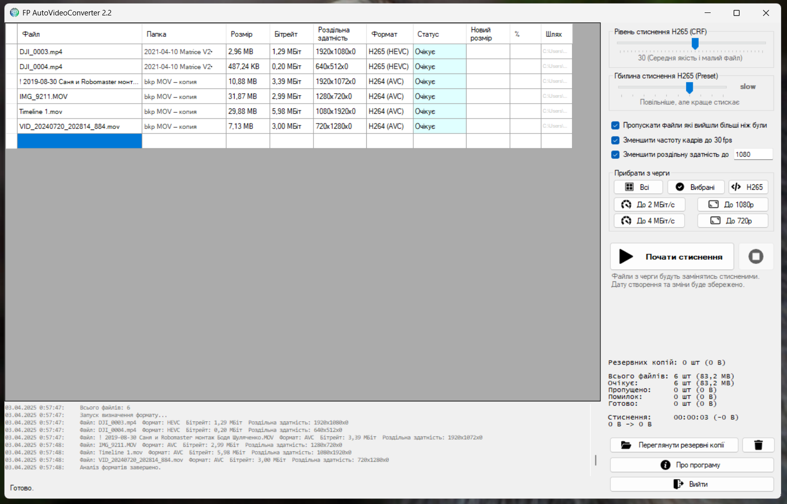
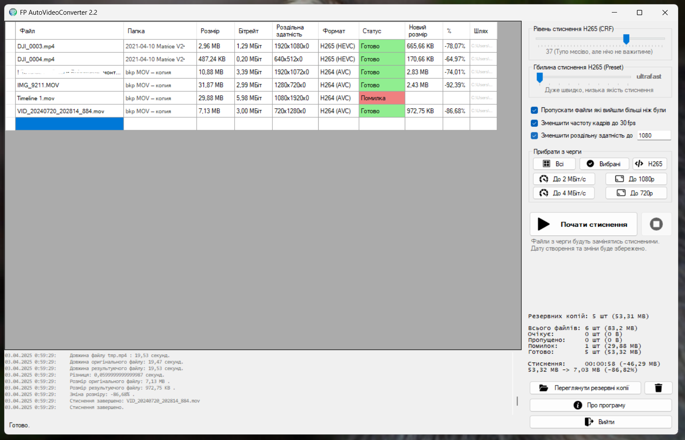
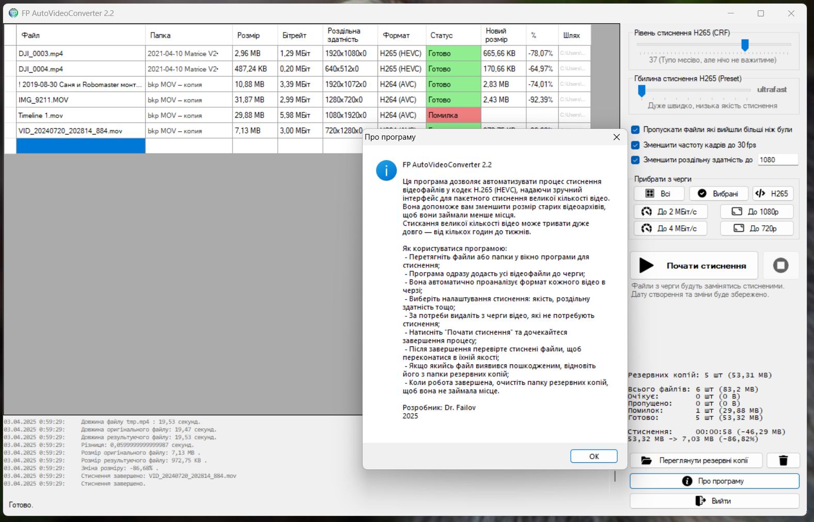

# Про проект FP Auto Video Converter 2.0

Ця програма дозволяє автоматизувати процес стиснення відеофайлів в H265 (HEVC),
надаючи зручний інтерфейс для обробки декількох файлів одночасно.
Допоможе стиснути ваші старі відео архіви щоб вони не займали так багато місця.

## Основні можливості:
- Не потребує додаткових бібліотек і залежностей, оскільки написана на .NET Framework 3.5 і використовує для роботи файли що лежать поряд.
- Дуже мало важить бо нічого зайвого
- Зручний і зрозумілий інтерфейс, і показує багато інформації
- Автоматично заміняє файли конвертованими, але робить бекапи оригіналів.
- Можна запустити з командного рядка автоматизувавши роботу
- Підтримка різних відеоформатів на вході
- Пакетна обробка файлів, можна закидувати цілими папками
- Є налаштування параметрів стиснення

Розробник: **Dr. Failov**
2025
