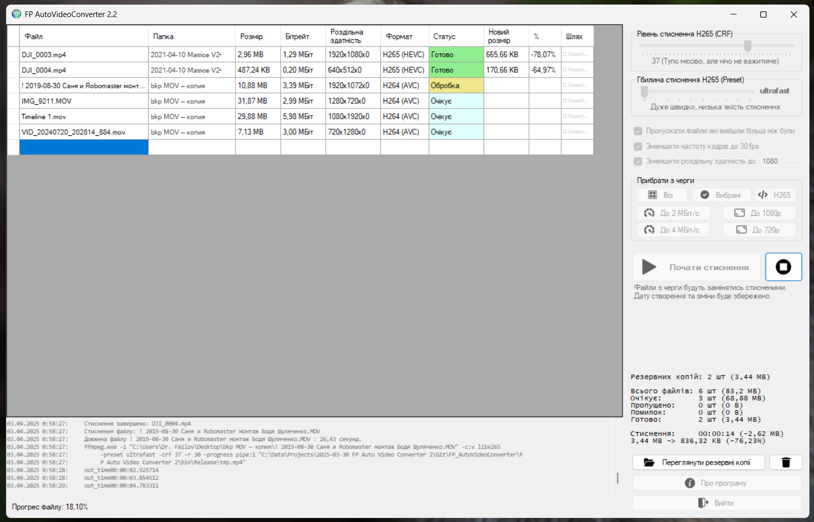

# Про проект FP Auto Video Converter 2.0

Ця програма дозволяє автоматизувати процес стиснення відеофайлів в H265 (HEVC),
надаючи зручний інтерфейс для обробки декількох файлів одночасно.
Допоможе стиснути ваші старі відео архіви щоб вони не займали так багато місця.

## Основні можливості:
- Не потребує додаткових бібліотек і залежностей, оскільки написана на .NET Framework 3.5 і використовує для роботи файли що лежать поряд.
- Дуже мало важить бо нічого зайвого
- Зручний і зрозумілий інтерфейс, і показує багато інформації
- Автоматично заміняє файли конвертованими, але робить бекапи оригіналів.
- Можна запустити з командного рядка автоматизувавши роботу
- Підтримка різних відеоформатів на вході
- Пакетна обробка файлів, можна закидувати цілими папками
- Є налаштування параметрів стиснення

## Як користуватися програмою
 - Перетягніть файли або папки у вікно програми для стиснення;
 - Програма одразу додасть усі відеофайли до черги;
 - Вона автоматично проаналізує формат кожного відео в черзі;
 - Виберіть налаштування стиснення: якість, роздільну здатність тощо;
 - За потреби видаліть з черги відео, які не потребують стиснення;
 - Натисніть \"Почати стиснення\" та дочекайтеся завершення процесу;
 - Після завершення перевірте стиснені файли, щоб переконатися в їхній якості;
 - Якщо якийсь файл виявився пошкодженим, відновіть його з папки резервних копій;
 - Коли робота завершена, очистіть папку резервних копій, щоб вона не займала місце.

Розробник: **Dr. Failov**
2025
