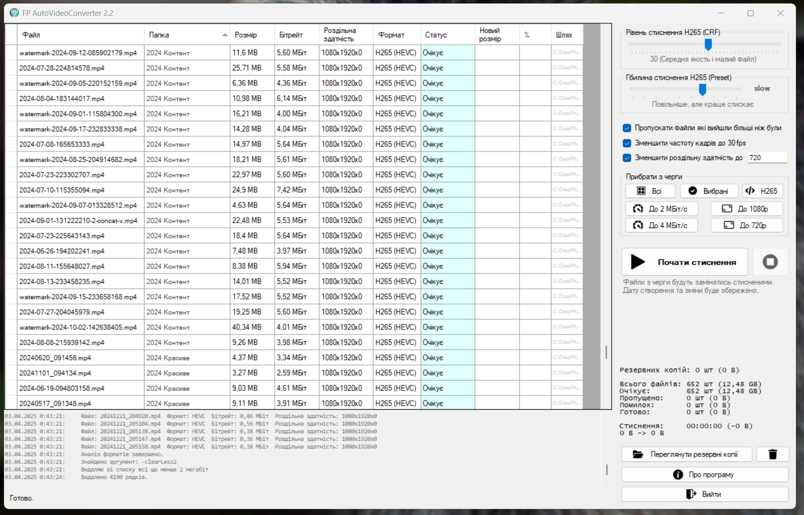

  

# 🎬 FP Auto Video Converter 2.3

  

**FP Auto Video Converter** – це програма для автоматичного стиснення відеофайлів у формат **H265 (HEVC)**.  
Вона надає зручний інтерфейс для пакетної обробки файлів і допоможе **зменшити розмір відеоархівів**, звільняючи місце на диску.

---

## 🚀 Основні можливості

✅ **Не потребує додаткових бібліотек та залежностей** – працює на **.NET Framework 3.5**, використовуючи файли, що знаходяться поряд.  
✅ **Компактний розмір** – займає мінімум місця.  
✅ **Зручний інтерфейс** – відображає багато корисної інформації.  
✅ **Автоматична заміна файлів** – конвертовані відео замінюють оригінали, але **створюються резервні копії**.  
✅ **Можливість запуску з командного рядка** – для автоматизації процесу.  
✅ **Підтримка різних відеоформатів** – програма працює з багатьма популярними форматами.  
✅ **Пакетна обробка файлів** – можна додавати **цілі папки** для обробки.  
✅ **Гнучкі налаштування** – дозволяє задавати **параметри стиснення**.

---

## 🖥 Інтерфейс програми

  
  

  
  

# 📖 Як користуватися програмою

1. 🔹 **Перетягніть файли або папки** у вікно програми для стиснення.  
2. 📂 Програма **одразу додасть усі відеофайли** до черги.  
3. 🔍 Вона **автоматично проаналізує формат** кожного відео.  
4. ⚙ **Виберіть налаштування стиснення**: якість, роздільну здатність тощо.  
5. 🗑 **За потреби видаліть** з черги відео, які не потребують стиснення.  
6. ▶ **Натисніть "Почати стиснення"** та дочекайтеся завершення процесу.  
7. ✅ **Перевірте стиснені файли**, щоб переконатися в їхній якості.  
8. ⚠ Якщо якийсь файл **виявився пошкодженим**, відновіть його з папки резервних копій.  
9. 🧹 **Очистіть папку резервних копій**, щоб вона не займала місце.  

---

# Аргументи для запуску з командного рядка

Можна використовувати різні аргументи для автоматизації, щоб керувати додатком.  
Ними можна буквально "натикати" потрібні кнопки без втручання користувача.  

## 📌 Основні
- `"Адреса папки"` — Додати папку. Пишіть з лапками, так надійніше.
- `"Адреса файлу"` — Додати файл. Пишіть з лапками, так надійніше.
- `-help` — Вивести це повідомлення в лог.

## 🎥 Опції стиснення
- `-skipY` — Поставити галочку **"Пропускати файли, які вийшли більші, ніж були"**.
- `-skipN` — Зняти галочку **"Пропускати файли, які вийшли більші, ніж були"**.
- `-reduceFramerate30` — Поставити галочку **"Зменшити частоту кадрів до 30"**.
- `-reduceFramerateN` — Зняти галочку **"Зменшити частоту кадрів до 30"**.
- `-scale1080` — Поставити галочку **"Зменшити роздільну здатність до 1080"** (або інше число).
- `-scaleN` — Зняти галочку **"Зменшити роздільну здатність до"**.
- `-crf33` — Задати **CRF=33** (або інше число).
- `-preset4` — Задати **preset=faster** (або інший, число до 10).

## 🗑 Очищення списку файлів
- `-clearResolution1080` — Видалити файли, менші за **1080** по меншій стороні (або інше число).
- `-clearBitrate10` — Видалити файли з бітрейтом менше **10** Mbps (або інше число).
- `-clearH265` — Видалити файли, що вже в кодеку **H265 (HEVC)**.

## ⚙ Автоматизація
- `-start` — Автоматичний запуск стиснення без втручання користувача.
- `-exit` — Автоматично вийти після завершення стиснення.

## ℹ Додаткова інформація
- **Аргументи чутливі до регістру**.
- **Невалідні аргументи ігноруються**.
- **Значення, які не уточнено аргументами, залишаються за замовчуванням**.

---

**Розробник:** Dr. Failov  
📅 2025
